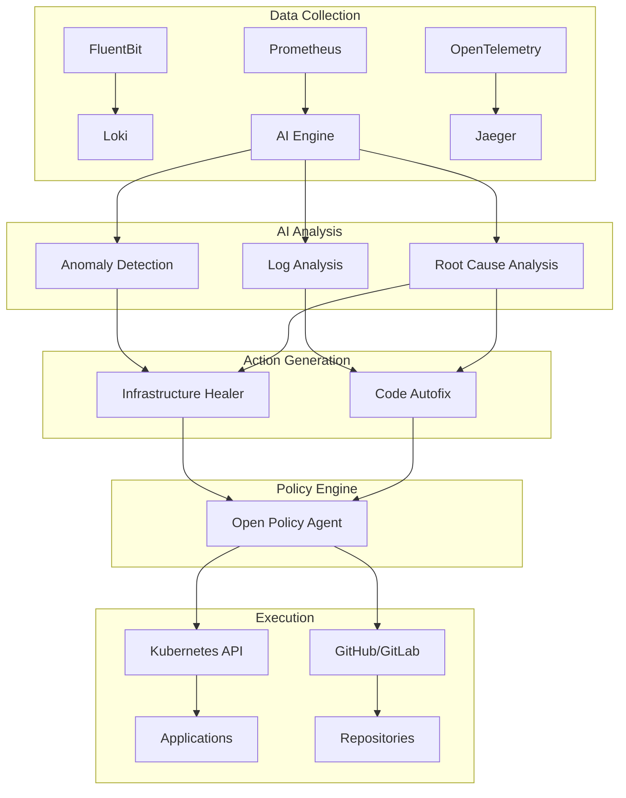

# MLOps Agent Stack Architecture

## Overview

The MLOps Agent Stack is a production-grade, cloud-agnostic AI agent cluster designed to autonomously monitor Kubernetes infrastructure, analyze logs and metrics using AI models, self-heal infrastructure issues, and automatically fix application bugs through GitOps workflows.

## Architecture Components

### 1. Data Collection Layer

#### Metrics Collection
- **Prometheus**: Core metrics collection and storage
- **Node Exporter**: System-level metrics (CPU, memory, disk, network)
- **Kube State Metrics**: Kubernetes object state metrics
- **Custom Exporters**: Application-specific metrics

#### Log Collection
- **FluentBit**: Lightweight log collector deployed as DaemonSet
- **Loki**: Log aggregation and storage
- **Log Parsing**: Structured parsing for error detection

#### Trace Collection
- **OpenTelemetry Collector**: Distributed tracing collection
- **Jaeger**: Trace storage and visualization
- **Service Mesh Integration**: Istio/Linkerd trace correlation

### 2. AI Analysis Engine

#### Anomaly Detection Model
```python
# LSTM-based time series anomaly detection
class AnomalyDetectionModel(nn.Module):
    def __init__(self, input_size, hidden_size=64, num_layers=2):
        super().__init__()
        self.lstm = nn.LSTM(input_size, hidden_size, num_layers, batch_first=True)
        self.fc = nn.Linear(hidden_size, 1)
```

**Features:**
- Real-time metric stream analysis
- Multi-dimensional anomaly detection
- Confidence scoring and severity assessment
- Context-aware alerting

#### Log Analysis Model
```python
# BERT-based log classification
class LogAnalysisModel(nn.Module):
    def __init__(self, vocab_size, embed_dim=256, num_classes=10):
        super().__init__()
        self.embedding = nn.Embedding(vocab_size, embed_dim)
        self.transformer = nn.TransformerEncoder(...)
        self.classifier = nn.Linear(embed_dim, num_classes)
```

**Error Categories:**
- CrashLoopBackOff
- OOMKilled
- ImagePullBackOff
- NetworkError
- DatabaseConnection
- AuthenticationFailure
- ConfigurationError
- PermissionDenied
- ResourceQuotaExceeded

#### Root Cause Analysis
- **Graph Neural Networks**: Map pod-node-service dependencies
- **Correlation Analysis**: Link metrics, logs, and traces
- **Impact Assessment**: Determine blast radius of issues

### 3. Self-Healing Infrastructure

#### Pod-Level Healing
```yaml
apiVersion: mlops.ai/v1
kind: InfraHealingRule
spec:
  scaling:
    pods:
      enabled: true
      maxReplicas: 50
      scaleUpThreshold: "75%"
      scaleDownThreshold: "25%"
  healthChecks:
    pods:
      restartThreshold: 3
      crashLoopBackoffAction: "restart"
      oomKilledAction: "increase-memory"
```

**Actions:**
- Horizontal Pod Autoscaling (HPA) adjustments
- Vertical Pod Autoscaling (VPA) recommendations
- Pod restart for crash loops
- Memory limit increases for OOM scenarios
- Resource quota adjustments

#### Node-Level Healing
```yaml
spec:
  scaling:
    nodes:
      enabled: true
      maxNodes: 20
      scaleUpCPUThreshold: "70%"
      scaleUpMemoryThreshold: "80%"
```

**Actions:**
- Cluster API-based node scaling
- Node replacement for unhealthy nodes
- Spot instance management
- Multi-AZ balancing

#### Deployment Rollbacks
- Automatic rollback on health check failures
- Performance degradation detection
- Error rate threshold monitoring
- Argo CD integration for GitOps rollbacks

### 4. Code-Level Autofixing

#### Issue Detection Pipeline
```python
def parse_logs_for_issues(logs: str) -> List[CodeIssue]:
    """Extract code issues from application logs"""
    for line in logs.split('\n'):
        if 'NullPointerException' in line:
            file_path, line_num = extract_location_from_stacktrace(line)
            yield CodeIssue(
                error_message=line,
                file_path=file_path,
                line_number=line_num,
                error_type='NullPointerException'
            )
```

#### LLM-Based Fix Generation
```python
async def generate_fix(self, error_message: str, code_context: str) -> FixResult:
    """Generate code fix using fine-tuned CodeLlama model"""
    prompt = f"""
    Fix the following error:
    Error: {error_message}
    Code: {code_context}
    
    Provide:
    1. Corrected code
    2. Explanation
    3. Unit test
    4. Risk assessment
    """
    return await self.llm_client.generate(prompt)
```

#### GitOps Integration
```python
async def create_pull_request_with_fix(self, issue: CodeIssue, fix: FixResult):
    """Create automated pull request with fix"""
    branch_name = f"autofix/{issue.error_type}/{timestamp}"
    
    # Create branch and update file
    await self.github_client.create_branch(repo, branch_name, base_sha)
    await self.github_client.update_file(repo, issue.file_path, fix.fixed_code, branch_name)
    
    # Create PR with detailed description
    pr_body = f"""
    ## Automated Code Fix
    **Error:** {issue.error_message}
    **Confidence:** {fix.confidence:.2%}
    **Risk Level:** {fix.risk_level}
    
    ### Changes
    {fix.explanation}
    """
    
    await self.github_client.create_pull_request(repo, title, pr_body, branch_name)
```

### 5. Security and Policy Framework

#### Open Policy Agent (OPA) Integration
```rego
package mlops.autofix

# Allow autofix actions based on risk level and file paths
allow if {
    input.action == "create_pr"
    input.risk_level in ["low", "medium"]
    allowed_file_path
    not excluded_file_path
    valid_repository
}

# Require approval for high-risk changes
requires_approval if {
    input.risk_level == "high"
    input.changes_count > 10
}
```

#### RBAC Configuration
```yaml
apiVersion: rbac.authorization.k8s.io/v1
kind: ClusterRole
metadata:
  name: mlops-ai-engine
rules:
- apiGroups: [""]
  resources: ["pods", "services", "endpoints", "nodes"]
  verbs: ["get", "list", "watch"]
- apiGroups: ["mlops.ai"]
  resources: ["autofixpolicies", "infrahealingrules"]
  verbs: ["get", "list", "watch", "create", "update", "patch"]
```

#### Code Signing and Verification
- **Cosign**: Sign container images and artifacts
- **Sigstore**: Transparency log for signatures
- **Policy Enforcement**: Require signed images in production

### 6. Monitoring and Observability

#### Metrics Dashboard
```yaml
# Grafana Dashboard Configuration
dashboards:
  aiMetrics:
    panels:
    - title: "Anomalies Detected"
      type: "stat"
      targets: ["mlops_anomalies_detected_total"]
    - title: "Fix Success Rate"
      type: "stat"
      targets: ["rate(mlops_fixes_successful[5m])"]
    - title: "Healing Actions"
      type: "graph"
      targets: ["mlops_healing_actions_total"]
```

#### Alerting Rules
```yaml
groups:
- name: mlops-agent-stack
  rules:
  - alert: HighAnomalyRate
    expr: rate(mlops_anomalies_detected_total[5m]) > 0.1
    for: 2m
    labels:
      severity: warning
    annotations:
      summary: "High anomaly detection rate"
  
  - alert: AutofixFailure
    expr: rate(mlops_fixes_failed_total[5m]) > 0.05
    for: 5m
    labels:
      severity: critical
    annotations:
      summary: "Autofix system experiencing failures"
```

## Data Flow Architecture



## Deployment Architecture

### Cloud-Agnostic Design
```yaml
# Cloud abstraction through CRDs
apiVersion: mlops.ai/v1
kind: CloudConfig
spec:
  provider: "azure"  # aws, gcp, digitalocean
  region: "eastus"
  nodeGroups:
  - name: "application-nodes"
    instanceType: "Standard_DS3_v2"  # Cloud-specific but abstracted
    minSize: 2
    maxSize: 20
```

### Multi-Cluster Support
- **Cluster API**: Manage multiple clusters
- **GitOps**: Consistent configuration across environments
- **Network Policies**: Secure inter-cluster communication
- **Certificate Management**: Automated TLS certificate rotation

### High Availability
- **Operator Replication**: Multiple replicas across failure domains
- **Data Persistence**: Persistent volumes for model storage
- **Backup Strategy**: Automated etcd and data backups
- **Disaster Recovery**: Cross-region replication capabilities

## Security Architecture

### Defense in Depth
1. **Network Security**: Network policies, service mesh mTLS
2. **Identity & Access**: RBAC, service accounts, OIDC integration
3. **Data Security**: Encryption at rest and in transit
4. **Runtime Security**: Pod security standards, admission controllers
5. **Supply Chain**: Image scanning, signed artifacts

### Audit and Compliance
```yaml
# Audit configuration
apiVersion: v1
kind: ConfigMap
metadata:
  name: audit-policy
data:
  policy.yaml: |
    rules:
    - level: Metadata
      namespaces: ["mlops-production"]
      resources:
      - group: "mlops.ai"
        resources: ["*"]
      - group: ""
        resources: ["pods", "services"]
```

### Zero Trust Model
- **Mutual TLS**: All service-to-service communication encrypted
- **Identity Verification**: Every request authenticated and authorized
- **Least Privilege**: Minimal required permissions
- **Continuous Monitoring**: All actions logged and audited

## Scaling and Performance

### Horizontal Scaling
```yaml
# HPA for AI Engine
apiVersion: autoscaling/v2
kind: HorizontalPodAutoscaler
metadata:
  name: ai-engine-hpa
spec:
  scaleTargetRef:
    apiVersion: apps/v1
    kind: Deployment
    name: ai-engine
  minReplicas: 2
  maxReplicas: 10
  metrics:
  - type: Resource
    resource:
      name: cpu
      target:
        type: Utilization
        averageUtilization: 70
  - type: Resource
    resource:
      name: memory
      target:
        type: Utilization
        averageUtilization: 80
```

### Performance Optimization
- **Model Optimization**: Quantization, pruning for inference speed
- **Caching Strategy**: Redis for frequently accessed data
- **Batch Processing**: Aggregate analysis for efficiency
- **Resource Allocation**: GPU scheduling for ML workloads

### Cost Optimization
- **Spot Instances**: Use spot instances for non-critical workloads
- **Right-sizing**: Automatic resource recommendations
- **Scheduled Scaling**: Scale down during off-hours
- **Multi-cloud**: Cost-aware workload placement

This architecture ensures a robust, scalable, and secure MLOps agent stack that can autonomously manage Kubernetes infrastructure while maintaining high reliability and performance standards.